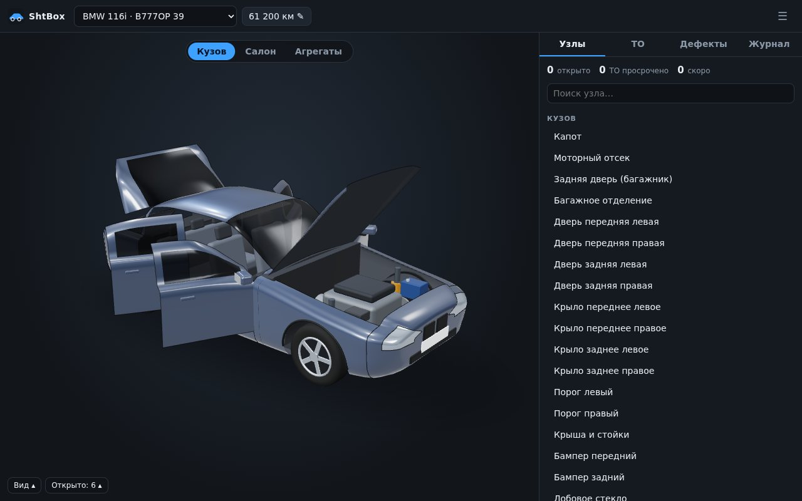
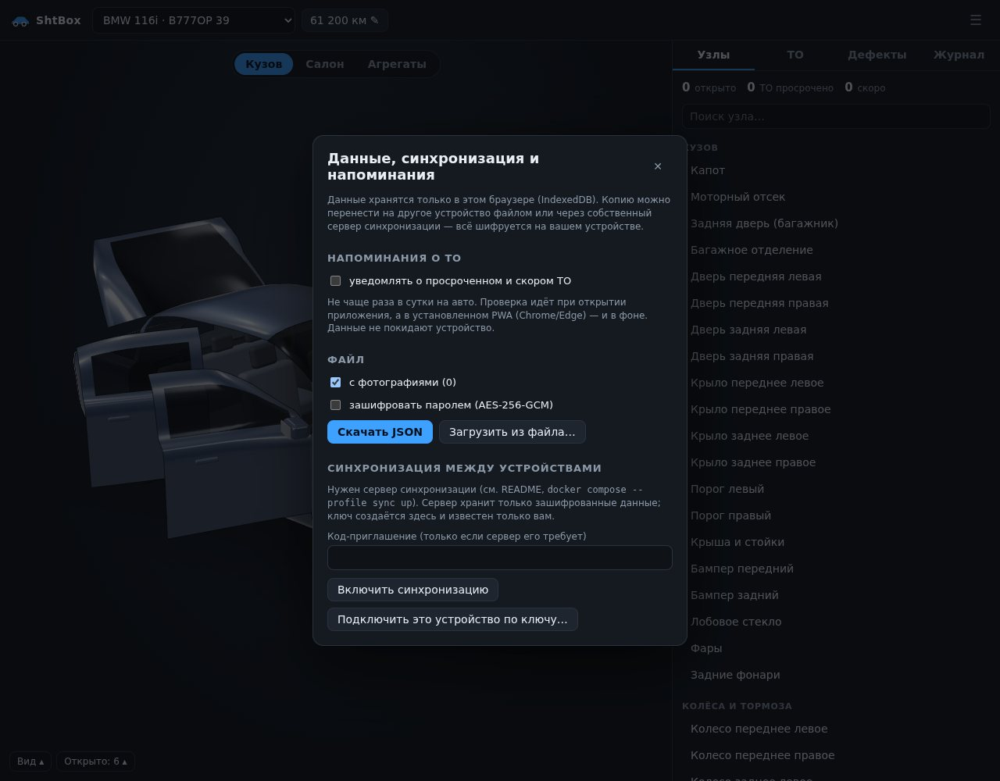

# ShtBox — журнал поломок и обслуживания автомобиля

Лёгкое офлайн-приложение (PWA): 3D-модель авто (по умолчанию седан в стиле Hyundai Solaris),
узлы, дефекты и доделки, регламентное ТО с периодичностью, история выполненных работ.

## Скриншоты

| | |
| --- | --- |
|  **Кузов с дефектами** — ржавчина, вмятины, сколы и царапины видны на модели, бейджи показывают открытые записи |  **Узел из списка** — камера подъезжает к нему, панель показывает открытые записи, регламент и историю |
|  **Слой «Агрегаты» и регламентное ТО** — просрочено / скоро / в норме |  **Журнал работ**, расходы по типам и открытые двери/капот/багажник |
|  **Вторая модель** — BMW 116i (хэтчбек, задний привод) с открытой пятой дверью |  **Меню ☰ → «Данные»** — резервная копия (в т.ч. с шифрованием), синхронизация, напоминания о ТО |

<p align="center"><br><em>Мобильная версия: 3D сверху, панель узлов — снизу</em></p>

## Возможности

- **3D-модель** с тремя слоями: кузов / салон / агрегаты (двигатель, КПП, подвеска, тормоза, выхлоп).
  Клик по узлу — панель узла (выбор из списка плавно подводит камеру к узлу); двойной клик по двери, капоту, багажнику — открыть. Бейджи показывают открытые записи и просроченное ТО.
- **Кузовные дефекты**: ржавчина, вмятины, сколы, царапины ставятся меткой прямо на панель (радиус 2–30 см).
  После отметки «выполнено» дефект исчезает с модели, остаётся лёгкий след ремонта, а запись уходит в журнал.
- **Узлы**: поломки, доработки, регламентные работы. Двери/капот/багажник, салон и колёса — отдельные узлы.
- **ТО**: периодичность по пробегу и/или по времени, статусы «просрочено / скоро / ОК», типовой регламент при создании авто.
- **Журнал**: все выполненные работы с датой, пробегом, стоимостью; фильтры, поиск, CSV. Выполнение можно вернуть в работу.
- **Расходы**: суммы по годам и типам работ, ориентировочная стоимость километра.
- **Календарь**: кнопка «Календарь» на вкладке ТО выгружает даты ближайших ТО в `.ics` (напоминание за 7 дней) — открывается в Google/Apple/Outlook-календаре.
- **Фото и чеки** к дефектам и записям журнала: сжимаются в браузере, метаданные (EXIF/GPS) удаляются, хранятся в IndexedDB.
- **Напоминания о ТО**: браузерные уведомления о просроченном и скором ТО — не чаще раза в сутки на авто ([подробнее](#напоминания-о-то)).
- **Модели**: Hyundai Solaris (седан) и BMW 116i (хэтчбек F20, задний привод) — обе процедурные; свои — процедурно или из glTF/GLB ([инструкция](docs/ADDING_MODELS.md)).
- **Несколько автомобилей**, резервная копия (JSON, по желанию с фото и с шифрованием паролем `.shtbox`) и [синхронизация между устройствами](#синхронизация-и-шифрование).

## Запуск

```bash
npm install
npm run dev        # разработка, http://localhost:5173
npm test           # unit-тесты (core + контракт моделей)
npm run build      # проверка типов + production-сборка в dist/
npm run preview    # просмотр prod-сборки
```

Node ≥ 20.

## Docker

Образ — статика в `nginx-unprivileged` (Alpine): без Node в рантайме, без root. **Файл `.env` не нужен**: приложение статическое и работает без каких-либо переменных окружения и секретов. Необязательные настройки (порт, код-приглашение для сервера синхронизации) описаны в [`.env.example`](.env.example).

### Быстрый старт

Нужны Docker 24+ и плагин Compose v2 (`docker compose version`).

```bash
git clone https://github.com/zoixc/shtbox.git && cd shtbox
docker compose up -d --build        # первая сборка ~1–2 мин: ставит зависимости и гоняет тесты
```

Откройте http://localhost:8080. Проверка: `curl -fsS localhost:8080/healthz` → `ok`, `docker compose ps` → `healthy`.

| Задача | Команда |
| --- | --- |
| Логи | `docker compose logs -f shtbox` |
| Остановить / запустить | `docker compose stop` / `docker compose start` |
| Обновить до новой версии | `git pull && docker compose up -d --build` |
| Удалить контейнер (данные автомобилей остаются в браузере) | `docker compose down` |
| Другой порт | `SHTBOX_PORT=9090 docker compose up -d` или строка `SHTBOX_PORT=9090` в `.env` |
| Вместе с сервером синхронизации | `docker compose --profile sync up -d --build` (см. [ниже](#синхронизация-и-шифрование)) |

Без compose:

```bash
docker build -t shtbox .
docker run -d --name shtbox -p 127.0.0.1:8080:8080 \
  --read-only --tmpfs /tmp:size=16m,mode=1777,noexec,nosuid,nodev \
  --cap-drop ALL --security-opt no-new-privileges:true \
  --pids-limit 64 --memory 128m --cpus 0.5 shtbox
```

**Доступ с других устройств.** Порт привязан к `127.0.0.1`, чтобы приложение случайно не оказалось в открытой сети. Для доступа снаружи поставьте перед контейнером TLS-прокси — service worker, установка как PWA и уведомления работают только по HTTPS (или на localhost). Пример для Caddy (сертификат выпускается автоматически):

```
shtbox.example.com {
    reverse_proxy 127.0.0.1:8080
    header Strict-Transport-Security "max-age=31536000"
}
```

**Данные** хранятся в браузере (IndexedDB), а не в контейнере: у сервиса `shtbox` нет томов, его можно пересоздавать когда угодно. Чтобы перенести данные между устройствами — резервная копия или синхронизация (меню ☰ → «Данные»).

**Если не запускается**

- `port is already allocated` — порт 8080 занят: задайте `SHTBOX_PORT`.
- Страница открывается, но нет установки PWA/уведомлений — вы зашли по обычному `http://` не с localhost; нужен HTTPS.
- Сборка падает на этапе тестов — приложите вывод `docker compose build --progress=plain`; тесты идут внутри сборки, чтобы образ не собрался из сломанного кода.

Что сделано для безопасности:

- **Многоступенчатая сборка**: Node, исходники и `node_modules` в итоговый образ не попадают; в сборке `npm ci --ignore-scripts`, перед упаковкой прогоняются тесты.
- **Не root**: `USER 101`, порт 8080, `cap_drop: ALL`, `no-new-privileges`.
- **Read-only ФС**: `read_only: true`, единственная записываемая область — `tmpfs /tmp` (`noexec,nosuid,nodev`); конфиг и статика принадлежат root.
- **Ограничения ресурсов**: `pids_limit`, память, CPU, `nofile`, ротация логов.
- **nginx**: только `GET/HEAD`, `server_tokens off`, короткие таймауты и лимиты запросов/соединений, `client_max_body_size 1k`, скрытые файлы и `.map` закрыты.
- **Заголовки** (`docker/security-headers.conf`): CSP (в т.ч. `frame-ancestors 'none'`), `nosniff`, `X-Frame-Options`, `Referrer-Policy: no-referrer`, `Permissions-Policy`, COOP/CORP.
- Порт в compose привязан к `127.0.0.1`. Для доступа снаружи поставьте перед контейнером TLS-прокси (Caddy/Traefik/nginx) и включите на нём HSTS: service worker и `storage.persist()` работают только по HTTPS (или localhost).
- Для воспроизводимости зафиксируйте базовые образы по digest: `--build-arg NODE_IMAGE=node:22-alpine@sha256:…`, `--build-arg NGINX_IMAGE=nginxinc/nginx-unprivileged:stable-alpine@sha256:…`.

Проверить образ на уязвимости: `docker scout cves shtbox` или `trivy image shtbox` (в CI Trivy проверяет каждый PR). Том есть только у необязательного сервиса `sync`.

## Синхронизация и шифрование

**Файл.** «Данные → Скачать» с флажком «зашифровать паролем» даёт `.shtbox`: gzip → AES-256-GCM, ключ из пароля через PBKDF2-SHA256 (600 000 итераций, случайная соль), формат проверяется до расшифровки, параметры KDF ограничены (защита от подсунутого файла с огромным числом итераций). Забытый пароль восстановить невозможно.

**Сервер синхронизации** (необязательный, без зависимостей, `server/sync-server.mjs`):

```bash
docker compose --profile sync up -d --build     # nginx проксирует /sync/v1/ → sync:8081
# локально: DATA_DIR=/tmp/sync node server/sync-server.mjs  (vite проксирует /sync на :8081)
```

Устройство A: «Данные → Включить синхронизацию» создаёт 160-битный ключ (`XXXX-…`, 8 групп). Устройство B: «Подключить по ключу» → «Получить». Синхронизация ручная («Отправить» / «Получить»).

- Из ключа через HKDF получаются три независимых значения: `id` хранилища, `token` доступа и ключ AES-256-GCM. Сервер видит `id`, `token` (хранит только его SHA-256) и шифртекст — ключ шифрования до него не доходит.
- Конфликты: оптимистичная блокировка (`ETag`/`If-Match`) — если другое устройство успело отправить раньше, отправка отклоняется, нужно сначала «Получить».
- «Получить → объединить» перезаписывает записи по id; **удаления не переносятся** (удалённое на одном устройстве может вернуться) — для точной копии выбирайте «заменить».
- Сервер: лимит размера хранилища (`MAX_BYTES`, 25 МБ) и их числа (`MAX_ENTRIES`), лимит запросов по IP, `INVITE` — код, без которого нельзя создавать новые хранилища; атомарная запись, `read_only`, `cap_drop: ALL`, порт наружу не публикуется.
- **Модель угроз.** Владелец сервера и наблюдатель сети не могут прочитать данные, но видят размер, время обновления и IP. Ключ = доступ: кто его знает, может читать и удалять хранилище. Потерян ключ — данные на сервере не восстановить (файловые копии остаются). Сервер за TLS-прокси — обязательно, если он доступен из интернета (иначе `token` виден в сети, хотя данные и остаются зашифрованными).
- В приложении с сервером и без него CSP не меняется: запросы идут на тот же origin (`connect-src 'self'`).

## Напоминания о ТО

«Данные → Напоминания о ТО» запрашивает разрешение браузера и включает уведомления. Проверка идёт при открытии приложения, при возврате на вкладку и раз в час; дополнительно регистрируется Periodic Background Sync (`shtbox-due`, не чаще раза в 12 часов), поэтому **в установленном PWA (Chrome/Edge)** уведомление может прийти и при закрытой вкладке.

- Всё считается на устройстве по данным из IndexedDB (`src/core/reminders.ts`, service worker — `src/sw.ts`); никакого push-сервера и передачи данных нет.
- Не чаще одного уведомления в сутки на автомобиль; в тексте — до 3 названий работ.
- Ограничения: Periodic Sync есть только в Chromium и только для установленного PWA (Safari/Firefox — уведомления лишь пока приложение открыто); браузер сам решает, когда запускать фоновую проверку. Надёжная альтернатива — выгрузка в календарь (вкладка «ТО» → «Календарь»).
- Настройка хранится в отдельном хранилище `meta` и не стирается при «заменить все данные».

## Стек и почему

| Задача | Решение |
| --- | --- |
| UI | Preact + @preact/signals (~10 KB, точечные обновления без vdom-перерисовок всего) |
| 3D | three.js, модель генерируется процедурно (без тяжёлых ассетов), грузится лениво |
| Данные | IndexedDB, только локально; ничего не уходит в сеть |
| Сборка | Vite; стартовый бандл ≈ 28 KB gzip, three и 3D — отдельные чанки |
| Оффлайн | service worker (network-first), `navigator.storage.persist()` |
| Безопасность | строгий CSP в prod (`script-src 'self'; style-src 'self'; connect-src 'self'`), нет `innerHTML`/eval, валидация импорта бэкапа, защита CSV от формульных инъекций |

## Архитектура

```
src/core/      предметная логика без UI и three: типы, валидация, IndexedDB, Store (signals)
src/models/    реестр моделей авто; sedan/ — процедурный седан (loft → build → solaris)
src/view3d/    Viewer (three), шейдер краски с дефектами (paintMaterial)
src/ui/, App.tsx, ViewerPane.tsx   интерфейс
tests/         core и контракт моделей
```

Данные ссылаются на модель по `modelId`, на узлы — по `zoneId`, на дефект кузова — по локальным
координатам метки в панели. Поэтому новые модели не ломают старые записи.

## Как добавить другую модель авто

Кратко: `CarModelDef` (узлы, регламент, фабрика 3D) → регистрация в `src/models/registry.ts` → `npm test`.
Модель можно сгенерировать процедурно (`SedanSpec`, примеры — Solaris и BMW 116i) или загрузить из glTF/GLB по соглашению
`extras` (`zone`, `paint`, `open`, …). Полная инструкция с экспортом из Blender — [docs/ADDING_MODELS.md](docs/ADDING_MODELS.md).

Окрашиваемые меши используют `createPaintMaterial` (`src/view3d/paintMaterial.ts`): он читает
локальные координаты вершины, поэтому подходит для любой геометрии.

## Кастомизация

- Регламент ТО — `defaultMaintenance` модели или вручную в интерфейсе.
- Типы дефектов, стили — `src/core/types.ts`, `src/styles.css` (CSS-переменные в `:root`).
- Резервные копии — кнопка «Данные» (экспорт/импорт, синхронизация, напоминания).

## E2E-тесты

Playwright прогоняет собранную prod-версию (строгий CSP, service worker) с настоящим сервером синхронизации: дефект с меткой на кузове → выполнение → журнал → перезагрузка; регламент; фото; зашифрованная копия; синхронизация двух «устройств» (сервер видит только шифртекст); напоминания; модель BMW.

```bash
npx playwright install chromium     # один раз
npm run e2e                         # сам соберёт сайт и поднимет сервер синхронизации
# свой Chromium: PW_CHROMIUM=/path/to/chrome PW_CHROMIUM_ARGS="--no-sandbox" npm run e2e
```

WebGL программный (SwiftShader), поэтому прогон занимает несколько минут. В headless Chromium `Notification.permission` всегда `denied`, поэтому в тесте напоминаний показ уведомления подменён заглушкой — проверяется логика (что и когда показывается), а не системное окно.

## CI

`.github/workflows/ci.yml`: юнит-тесты, `npm audit`, сборка; job `e2e` (Playwright, отчёт/трассы при падении — артефактом); hadolint для Dockerfile, сборка образа, Trivy (HIGH/CRITICAL) и smoke-тест контейнера с боевыми флагами (read-only, `cap-drop ALL`, заголовки безопасности, 403 на POST).
